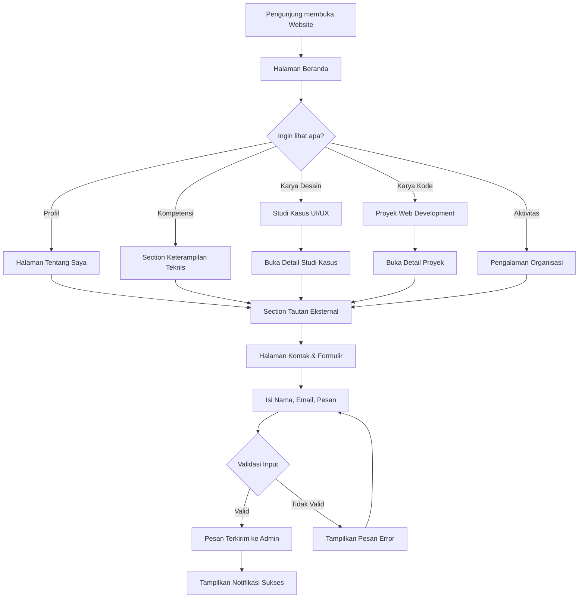

# Product Requirement Document (PRD)
## Portofolio Web — Personal Portfolio Website

**Versi Dokumen:** 1.0
**Tanggal:** 18 Juli 2026
**Disusun oleh:** Senior Product Manager
**Status:** Draft — Siap untuk Review Engineering

---

## 1. Gambaran Umum Produk

### Latar Belakang
Saat ini, pemilik produk belum memiliki satu platform terpusat yang menampilkan seluruh kompetensi, pengalaman, dan karya secara profesional. Informasi tentang keterampilan teknis (Laravel, Flutter, Figma, SPSS, dll.), studi kasus UI/UX, proyek web development, hingga pengalaman organisasi tersebar di berbagai platform terpisah (GitHub, Figma, LinkedIn, media sosial, dokumen fisik). Kondisi ini menyulitkan pihak lain (recruiter, klien, dosen, mitra kolaborasi) untuk menilai kompetensi secara cepat, konsisten, dan komprehensif dalam satu tempat.

Dengan meningkatnya persaingan di dunia kerja dan kebutuhan personal branding yang kuat, sebuah website portofolio yang responsif, rapi, dan mencerminkan identitas profesional menjadi kebutuhan mendasar — terutama bagi individu dengan latar belakang lintas disiplin (UI/UX Design, Web Development, dan riset/analisis data).

### Pernyataan Masalah
1. **Informasi tersebar dan tidak konsisten** — CV, portofolio desain, dan repositori kode berada di platform yang berbeda-beda sehingga sulit diakses dalam satu alur yang runtut.
2. **Kurangnya kesan profesional yang konsisten** — Tanpa branding visual yang seragam, kesan pertama yang diterima recruiter/klien menjadi tidak maksimal dan mudah terlupakan.
3. **Tidak ada media presentasi studi kasus yang mendalam** — Platform seperti media sosial tidak mendukung penyajian studi kasus UI/UX (proses, wireframe, mockup) secara naratif dan terstruktur.
4. **Aksesibilitas lintas perangkat yang buruk** — Banyak portofolio versi lama tidak responsif, sehingga pengalaman membuka portofolio dari perangkat mobile menjadi tidak optimal, padahal mayoritas recruiter/klien mengakses awal melalui ponsel.
5. **Sulit dihubungi melalui satu kanal resmi** — Tidak adanya formulir kontak terpusat membuat proses follow-up peluang kerja/kolaborasi menjadi lambat dan tidak tercatat rapi.

### Tujuan Produk
* Menyediakan satu platform web terpusat, responsif, dan konsisten secara visual untuk menampilkan profil, keterampilan, studi kasus, dan proyek.
* Meningkatkan personal branding pemilik portofolio agar lebih mudah diingat dan dipercaya oleh recruiter, klien, maupun mitra kolaborasi.
* Memberikan pengalaman navigasi yang cepat, ringan, dan nyaman diakses dari perangkat apa pun (desktop, tablet, mobile).
* Memudahkan pihak ketiga menghubungi pemilik portofolio melalui formulir kontak yang jelas dan tautan eksternal (GitHub, Figma, LinkedIn) yang mudah ditemukan.
* Menghindari kesan "template AI generik" (AI slop) dengan desain yang autentik, personal, dan dikembangkan secara manual menggunakan HTML, CSS, PHP, dan Tailwind CSS.

### Target Pengguna
* **Recruiter / HR perusahaan** — mencari kandidat dengan kompetensi UI/UX Design dan Web Development.
* **Klien freelance/proyek** — mencari jasa pembuatan desain atau aplikasi web.
* **Dosen / pihak akademik** — menilai portofolio untuk keperluan akademik (skripsi, magang, lomba).
* **Rekan kolaborasi/organisasi** — melihat rekam jejak pengalaman organisasi dan sosial.
* **Pemilik portofolio sendiri (Admin)** — sebagai pengelola konten yang menampilkan dan memperbarui informasi di website (jika terdapat panel pengelolaan konten sederhana berbasis PHP).

---

## 2. Peran Pengguna (User Roles) & User Stories

### Definisi Peran
| Peran | Deskripsi |
|---|---|
| **Pengunjung (Visitor)** | Siapa saja yang mengakses website tanpa login — recruiter, klien, dosen, rekan organisasi. |
| **Pemilik/Admin** | Pemilik portofolio yang mengelola konten, memperbarui data proyek, dan menerima pesan dari formulir kontak. |

### User Stories

**Sebagai Pengunjung (Visitor):**
* Sebagai pengunjung, saya ingin melihat halaman beranda dengan foto profil dan ringkasan diri, sehingga saya bisa langsung mendapat kesan awal tentang pemilik portofolio.
* Sebagai pengunjung, saya ingin membaca halaman "Tentang Saya", sehingga saya memahami latar belakang, minat, dan nilai profesional pemilik portofolio.
* Sebagai pengunjung, saya ingin melihat daftar keterampilan teknis beserta ikon tools yang dikuasai, sehingga saya bisa menilai kesesuaian kompetensi dengan kebutuhan saya.
* Sebagai pengunjung, saya ingin membuka studi kasus UI/UX secara detail (wireframe, mockup, proses desain), sehingga saya memahami cara berpikir dan proses kerja pemilik portofolio.
* Sebagai pengunjung, saya ingin melihat tangkapan layar dan deskripsi proyek web development, sehingga saya bisa menilai kualitas hasil kerja secara teknis.
* Sebagai pengunjung, saya ingin melihat dokumentasi pengalaman organisasi dan sosial, sehingga saya bisa menilai soft skill dan kontribusi sosial pemilik portofolio.
* Sebagai pengunjung, saya ingin mengakses tautan eksternal (GitHub, Figma, LinkedIn) dengan satu klik, sehingga saya bisa melihat detail lebih lanjut di platform aslinya.
* Sebagai pengunjung, saya ingin mengisi formulir kontak, sehingga saya bisa langsung menghubungi pemilik portofolio tanpa harus mencari email secara manual.
* Sebagai pengunjung, saya ingin website tetap nyaman dilihat di HP, tablet, maupun laptop, sehingga saya tidak kesulitan membaca konten dari perangkat apa pun.

**Sebagai Pemilik/Admin:**
* Sebagai admin, saya ingin menerima notifikasi/pesan dari formulir kontak, sehingga saya tidak melewatkan peluang kerja atau kolaborasi.
* Sebagai admin, saya ingin struktur kode (HTML/CSS/PHP) yang rapi dan modular, sehingga saya bisa memperbarui konten (proyek baru, studi kasus baru) dengan mudah tanpa merombak keseluruhan halaman.
* Sebagai admin, saya ingin tampilan website konsisten di semua halaman, sehingga branding personal saya terjaga dan terlihat profesional.

---

## 3. Ruang Lingkup (Scope of Work)

### In-Scope (MVP)
* Halaman **Beranda** (Hero section dengan foto profil/avatar/ilustrasi AI, ringkasan singkat, CTA ke bagian lain).
* Halaman **Tentang Saya** (foto diri, narasi latar belakang, minat, dan value proposition).
* Halaman/Section **Keterampilan Teknis** (grid ikon tools: Laravel, Flutter, Figma, SPSS, dll., dikelompokkan per kategori).
* Halaman **Studi Kasus UI/UX Design** (list studi kasus + halaman detail per studi kasus berisi wireframe, mockup, proses desain).
* Halaman **Proyek Web Development** (list proyek + detail proyek berisi tangkapan layar, deskripsi, tech stack, tautan demo/repo).
* Halaman **Pengalaman Organisasi & Sosial** (timeline/list kegiatan beserta foto dokumentasi).
* Section **Tautan Portofolio Eksternal** (ikon GitHub, Figma, LinkedIn yang mengarah ke profil eksternal).
* Halaman **Kontak & Formulir** (formulir nama, email, subjek, pesan; ikon pendukung media sosial/email).
* Navigasi utama (navbar) responsif dengan mode mobile (hamburger menu).
* Footer dengan informasi copyright dan tautan cepat.
* Struktur layout menggunakan Tailwind CSS, dengan backend sederhana PHP untuk memproses formulir kontak (kirim email/simpan ke database).
* Desain fully responsive (mobile, tablet, desktop).

### Out-of-Scope
* Sistem CMS (Content Management System) penuh dengan panel admin login untuk mengubah konten secara dinamis — konten pada fase ini dikelola langsung melalui kode/file data statis (misal file PHP array/JSON), bukan dashboard admin interaktif.
* Fitur multi-bahasa (i18n) — website hanya menggunakan satu bahasa (Bahasa Indonesia dan/atau Inggris, dipilih salah satu sebagai bahasa utama).
* Fitur blog/artikel.
* Sistem komentar atau rating pada studi kasus/proyek.
* Integrasi analitik lanjutan (heatmap, A/B testing).
* Dark mode (dapat menjadi pertimbangan Future Enhancement).
* Autentikasi pengguna/login untuk pengunjung.

---

## 4. Kebutuhan Sistem (Functional & Non-Functional)

### Kebutuhan Fungsional
1. **Navigasi Halaman** — Sistem menyediakan navbar tetap (sticky navbar) yang memungkinkan pengunjung berpindah antar section/halaman (Beranda, Tentang, Keterampilan, Studi Kasus, Proyek, Organisasi, Kontak) dengan smooth scroll atau routing sederhana berbasis PHP include.
2. **Tampilan Galeri/Grid Proyek** — Setiap studi kasus dan proyek ditampilkan dalam bentuk card/grid yang dapat diklik untuk menuju halaman detail.
3. **Halaman Detail Studi Kasus & Proyek** — Menampilkan galeri gambar (wireframe, mockup, screenshot), deskripsi proses, tools yang digunakan, serta tautan eksternal terkait (jika ada).
4. **Formulir Kontak** — Form dengan validasi input (nama, email format valid, pesan tidak kosong) yang diproses melalui PHP (`mail()` function atau penyimpanan ke database/file log) dan menampilkan pesan sukses/gagal ke pengguna tanpa reload penuh (dapat menggunakan validasi sisi klien dan server).
5. **Ikon Keterampilan & Tools** — Menampilkan ikon/logo tools secara visual dalam grid dengan label nama tools, dikelompokkan berdasarkan kategori (misal: Design Tools, Development Tools, Data Analysis Tools).
6. **Tautan Eksternal** — Ikon yang mengarah ke GitHub, Figma, dan LinkedIn terbuka di tab baru (`target="_blank"`) dengan atribut keamanan `rel="noopener noreferrer"`.
7. **Lightbox/Preview Gambar** — Gambar pada studi kasus dan proyek dapat diperbesar (lightbox sederhana menggunakan CSS/JS ringan) untuk melihat detail desain/tangkapan layar.
8. **Responsive Layout** — Seluruh halaman menyesuaikan ukuran layar menggunakan sistem grid dan breakpoint Tailwind CSS (`sm`, `md`, `lg`, `xl`).

### Kebutuhan Non-Fungsional
* **Performa:** Waktu muat halaman (First Contentful Paint) di bawah 2 detik pada koneksi 4G standar; gambar dioptimasi (kompresi, format WebP jika memungkinkan) dan menggunakan lazy loading.
* **Keamanan Data:** Input formulir kontak divalidasi dan disanitasi di sisi server (PHP) untuk mencegah XSS dan SQL Injection (menggunakan prepared statement bila terhubung ke database, serta `htmlspecialchars()` untuk output).
* **Responsivitas Tampilan:** Wajib mobile-friendly, diuji minimal pada breakpoint 375px (mobile), 768px (tablet), dan 1280px (desktop).
* **Ketersediaan Sistem:** Ditargetkan uptime hosting minimal 99% (bergantung pada penyedia hosting yang dipilih).
* **Kompatibilitas Browser:** Berfungsi baik di Chrome, Firefox, Safari, dan Edge versi terbaru (2 versi terakhir masing-masing browser).
* **Aksesibilitas (a11y):** Menggunakan atribut `alt` pada seluruh gambar, kontras warna teks-background yang memenuhi standar WCAG AA, serta navigasi yang dapat diakses via keyboard.
* **Maintainability:** Struktur kode PHP menggunakan *partial/include* (header, footer, navbar) agar mudah dipelihara tanpa duplikasi kode di setiap halaman.

---

## 5. Aturan Bisnis (Business Rules)

1. Setiap studi kasus dan proyek yang ditampilkan wajib memiliki minimal satu gambar pendukung (wireframe/mockup untuk studi kasus, screenshot untuk proyek web).
2. Formulir kontak wajib memvalidasi format email yang benar sebelum data dapat dikirim.
3. Tautan eksternal (GitHub, Figma, LinkedIn) hanya ditampilkan apabila URL valid dan aktif; tautan rusak (broken link) tidak boleh ditampilkan ke publik.
4. Konten pada halaman "Kontak" tidak wajib disertai gambar, kecuali ikon pendukung (email, telepon, media sosial).
5. Seluruh gambar yang diunggah harus melalui proses kompresi/optimasi sebelum ditampilkan untuk menjaga performa halaman.
6. Data yang dikirimkan melalui formulir kontak tidak ditampilkan secara publik di halaman mana pun (privasi pengunjung yang mengisi form terjaga).
7. Desain wajib konsisten menggunakan satu set warna (color palette), tipografi, dan spacing yang telah ditentukan pada design system agar tidak terkesan sebagai template AI generik.

---

## 6. Alur & Proses (User Flow & Business Flow)

### User Flow (Pengunjung)


### Business Process Flow

```mermaid
flowchart LR
    subgraph Persiapan
        P1[Admin menyiapkan konten: teks, foto, ikon, mockup]
        P2[Admin mengoptimasi gambar]
        P3[Admin menyusun struktur folder & data proyek]
    end
    subgraph Pelaksanaan
        E1[Website di-deploy ke hosting]
        E2[Pengunjung mengakses & menjelajah konten]
        E3[Pengunjung mengisi formulir kontak]
    end
    subgraph Penyelesaian
        F1[Sistem PHP memvalidasi & mengirim data formulir]
        F2[Admin menerima notifikasi email/pesan]
        F3[Admin menindaklanjuti peluang kerja/kolaborasi]
    end
    Persiapan --> Pelaksanaan --> Penyelesaian
```


---

## 7. Kriteria Penerimaan (Acceptance Criteria)

**Fitur: Formulir Kontak**
* **Given** pengunjung berada di halaman Kontak,
  **When** pengunjung mengisi nama, email, dan pesan dengan benar lalu menekan tombol "Kirim",
  **Then** sistem menampilkan notifikasi sukses dan data pesan diteruskan ke admin (email/log).

* **Given** pengunjung berada di halaman Kontak,
  **When** pengunjung mengisi email dengan format tidak valid (contoh: "abc@"),
  **Then** sistem menampilkan pesan error yang jelas tanpa mengirim data.

**Fitur: Navigasi Responsif**
* **Given** pengunjung mengakses website dari perangkat mobile (lebar layar < 768px),
  **When** pengunjung menekan ikon menu (hamburger),
  **Then** sistem menampilkan daftar navigasi dalam bentuk dropdown/sidebar yang mudah diakses satu tangan.

**Fitur: Halaman Detail Studi Kasus**
* **Given** pengunjung berada di halaman daftar Studi Kasus UI/UX,
  **When** pengunjung mengklik salah satu card studi kasus,
  **Then** sistem menampilkan halaman detail berisi galeri wireframe/mockup, deskripsi proses desain, dan tools yang digunakan.

**Fitur: Tautan Eksternal**
* **Given** pengunjung berada di section Tautan Portofolio Eksternal,
  **When** pengunjung mengklik ikon GitHub/Figma/LinkedIn,
  **Then** sistem membuka tautan tersebut pada tab baru tanpa memengaruhi sesi browsing pengunjung di tab asal.

---

## 8. Arsitektur Data & Tech Stack

### Struktur Data / Gambaran Database
Karena MVP tidak menggunakan CMS dinamis penuh, database dirancang ringan (opsional — dapat berupa file JSON/array PHP statis atau tabel database sederhana bila formulir kontak ingin disimpan histori-nya).

**Tabel `messages`** (menyimpan data formulir kontak)
| Kolom | Tipe Data | Keterangan |
|---|---|---|
| id | INT (PK, AUTO_INCREMENT) | ID unik pesan |
| name | VARCHAR(100) | Nama pengirim |
| email | VARCHAR(150) | Email pengirim |
| subject | VARCHAR(150) | Subjek pesan (opsional) |
| message | TEXT | Isi pesan |
| created_at | DATETIME | Waktu pengiriman |

**Tabel `projects`** (data proyek web development, opsional bila ingin dikelola via database)
| Kolom | Tipe Data | Keterangan |
|---|---|---|
| id | INT (PK, AUTO_INCREMENT) | ID unik proyek |
| title | VARCHAR(150) | Judul proyek |
| description | TEXT | Deskripsi proyek |
| tech_stack | VARCHAR(255) | Teknologi yang digunakan |
| image_path | VARCHAR(255) | Path gambar tangkapan layar |
| demo_url | VARCHAR(255) | Tautan demo (opsional) |
| repo_url | VARCHAR(255) | Tautan repositori GitHub (opsional) |

**Tabel `case_studies`** (data studi kasus UI/UX, opsional bila ingin dikelola via database)
| Kolom | Tipe Data | Keterangan |
|---|---|---|
| id | INT (PK, AUTO_INCREMENT) | ID unik studi kasus |
| title | VARCHAR(150) | Judul studi kasus |
| summary | TEXT | Ringkasan proses desain |
| tools_used | VARCHAR(255) | Tools yang digunakan (Figma, dll.) |
| image_path | VARCHAR(255) | Path gambar wireframe/mockup |
| figma_url | VARCHAR(255) | Tautan Figma (opsional) |

**Relasi:** Untuk MVP tanpa fitur multi-user, tabel-tabel di atas bersifat independen (tidak memerlukan foreign key kompleks). Jika ke depan ditambahkan fitur kategori, dapat dibuat tabel `categories` yang di-relasikan ke `projects` dan `case_studies` melalui `category_id`.

> **Catatan:** Mengingat batasan teknologi yang diminta (PHP, HTML, CSS, Tailwind CSS — tanpa framework backend seperti Laravel), penyimpanan data proyek/studi kasus untuk MVP dapat cukup menggunakan **array/JSON statis di dalam file PHP** (misalnya `data/projects.php`), sehingga tidak wajib menyiapkan database MySQL kecuali formulir kontak ingin disimpan histori pesannya.

### Gambaran API
Karena arsitektur menggunakan PHP native (bukan framework berbasis API/JSON penuh), "API" di sini berupa endpoint PHP yang memproses request dari form/JavaScript fetch (opsional untuk pengiriman form tanpa reload).

| Method | Endpoint | Request Body | Response |
|---|---|---|---|
| POST | `/api/send-message.php` | `{name, email, subject, message}` | `{status: "success", message: "Pesan berhasil dikirim"}` atau `{status: "error", message: "Email tidak valid"}` |
| GET | `/api/get-projects.php` | — | `{status: "success", data: [ {id, title, description, tech_stack, image_path, demo_url, repo_url}, ... ]}` |
| GET | `/api/get-case-studies.php` | — | `{status: "success", data: [ {id, title, summary, tools_used, image_path, figma_url}, ... ]}` |
| GET | `/api/get-project-detail.php?id=` | Query param: `id` | `{status: "success", data: {id, title, description, gallery: [...], tech_stack, demo_url, repo_url}}` |
| GET | `/api/get-case-study-detail.php?id=` | Query param: `id` | `{status: "success", data: {id, title, summary, gallery: [...], tools_used, figma_url}}` |

### Teknologi yang Digunakan (Tech Stack)
Sesuai preferensi eksplisit pemilik produk (menghindari framework berat dan menjaga stack tetap sederhana):

* **Frontend:** HTML5, CSS3, Tailwind CSS (via CDN atau build process ringan dengan Tailwind CLI), JavaScript vanilla (untuk interaksi ringan: hamburger menu, lightbox gambar, validasi form sisi klien).
* **Backend:** PHP native (tanpa framework seperti Laravel), menggunakan struktur *include/require* untuk komponen berulang (header, footer, navbar).
* **Database (opsional):** MySQL/MariaDB — hanya digunakan jika histori pesan formulir kontak ingin disimpan permanen; jika tidak, cukup gunakan `mail()` PHP atau penyimpanan log file `.txt`/`.json`.
* **Hosting/Cloud:** Shared hosting berbasis PHP (contoh: Niagahoster, Hostinger) atau layanan VPS ringan; domain kustom disarankan untuk branding profesional (contoh: `namaanda.dev` atau `namaanda.my.id`).

### Struktur Proyek
```
portofolio-web/
├── index.php                  # Halaman Beranda
├── about.php                  # Halaman Tentang Saya
├── skills.php                 # Halaman/Section Keterampilan Teknis
├── case-studies.php           # Daftar Studi Kasus UI/UX
├── case-study-detail.php      # Detail Studi Kasus (berdasarkan ?id=)
├── projects.php               # Daftar Proyek Web Development
├── project-detail.php         # Detail Proyek (berdasarkan ?id=)
├── organization.php           # Pengalaman Organisasi & Sosial
├── contact.php                # Kontak & Formulir
│
├── includes/
│   ├── header.php             # Head, meta tag, link CSS
│   ├── navbar.php             # Navigasi utama
│   └── footer.php             # Footer & script JS
│
├── api/
│   ├── send-message.php
│   ├── get-projects.php
│   ├── get-case-studies.php
│   ├── get-project-detail.php
│   └── get-case-study-detail.php
│
├── data/
│   ├── projects.php            # Data statis proyek (array PHP)
│   ├── case-studies.php        # Data statis studi kasus (array PHP)
│   └── skills.php              # Data statis keterampilan & tools
│
├── assets/
│   ├── css/
│   │   └── style.css           # Custom CSS tambahan di luar Tailwind
│   ├── js/
│   │   ├── main.js             # Hamburger menu, smooth scroll
│   │   ├── lightbox.js         # Preview gambar
│   │   └── form-validation.js  # Validasi form kontak sisi klien
│   └── images/
│       ├── profile/
│       ├── skills-icons/
│       ├── case-studies/
│       ├── projects/
│       └── organization/
│
├── config/
│   └── db.php                  # Koneksi database (jika digunakan)
│
└── README.md
```

---

## 9. Asumsi, Batasan, & Risiko

### Asumsi
* Pemilik portofolio memiliki seluruh aset gambar (foto profil, foto diri, ikon tools, wireframe, mockup, screenshot proyek, dokumentasi kegiatan) sebelum proses development dimulai.
* Pengunjung mengakses website menggunakan browser modern dengan koneksi internet yang memadai.
* Formulir kontak menggunakan layanan pengiriman email standar (SMTP) yang tersedia di hosting.
* Konten (teks dan gambar) tidak berubah secara sangat sering, sehingga pengelolaan data statis (array/JSON di file PHP) dianggap cukup untuk MVP.

### Batasan Sistem
* Sistem tidak dilengkapi dashboard admin interaktif; pembaruan konten dilakukan langsung melalui pengeditan file data oleh developer/pemilik.
* Kapasitas pengiriman email formulir kontak bergantung pada limitasi hosting (umumnya beberapa ratus email per hari pada shared hosting).
* Tidak ada dukungan multi-bahasa pada versi MVP.
* Ukuran total galeri gambar per studi kasus/proyek dibatasi maksimal 10 gambar untuk menjaga performa halaman.

### Risiko Pengembangan
| Risiko | Dampak | Strategi Mitigasi |
|---|---|---|
| Spam pada formulir kontak | Kotak masuk admin penuh pesan tidak relevan | Menambahkan honeypot field sederhana dan/atau validasi captcha ringan (Google reCAPTCHA) |
| Gambar tidak dioptimasi | Waktu muat halaman lambat, pengalaman pengguna buruk | Kompresi gambar (TinyPNG/WebP) dan lazy loading sebelum upload ke server |
| Desain terkesan generik/template AI | Menurunkan nilai personal branding | Kustomisasi desain: tipografi unik, ilustrasi personal, micro-interaction, hindari komponen Tailwind default tanpa modifikasi |
| Kebocoran data formulir kontak | Data pengunjung (nama, email) disalahgunakan | Sanitasi input, enkripsi koneksi (HTTPS/SSL), pembatasan akses ke tabel database |
| Broken link ke platform eksternal (GitHub/Figma/LinkedIn) | Kesan tidak profesional bagi pengunjung | Pengecekan berkala tautan eksternal secara manual sebelum publikasi ulang |

---

## 10. Pengembangan di Masa Depan (Future Enhancements)

* Penambahan **panel admin (CMS ringan)** berbasis PHP agar konten proyek dan studi kasus dapat dikelola tanpa mengedit kode langsung.
* Fitur **dark mode** menggunakan Tailwind CSS `dark:` variant.
* **Multi-bahasa** (Indonesia/Inggris) untuk menjangkau recruiter/klien internasional.
* Integrasi **Google Analytics** untuk memantau jumlah pengunjung dan halaman yang paling banyak dilihat.
* Fitur **blog/artikel** untuk berbagi wawasan seputar UI/UX dan Web Development guna memperkuat personal branding.
* **Filter dan pencarian** pada halaman Proyek dan Studi Kasus berdasarkan kategori/tools yang digunakan.
* Optimasi **SEO lanjutan** (structured data, sitemap.xml, open graph meta tag untuk pratinjau tautan di media sosial).
* Integrasi **PDF resume/CV otomatis** yang dapat diunduh langsung dari halaman Tentang Saya.

---

## 11. Lampiran (Opsional)

### Glosarium
* **AI Slop:** Istilah untuk konten/desain yang terlihat generik, tidak autentik, dan hasil dari proses otomatis tanpa sentuhan personal — dihindari dalam proyek ini demi menjaga keaslian branding.
* **MVP (Minimum Viable Product):** Versi produk dengan fitur minimum namun fungsional yang dapat langsung dirilis dan digunakan.
* **Lightbox:** Komponen UI untuk menampilkan gambar dalam ukuran lebih besar/detail saat diklik, biasanya dengan latar belakang gelap semi-transparan.
* **Sticky Navbar:** Navigasi yang tetap terlihat (menempel) di bagian atas layar meskipun pengguna melakukan scroll ke bawah.

### Referensi Desain
* Palet warna dan tipografi akan ditentukan lebih lanjut pada tahap UI Design (sebelum development), namun disarankan menggunakan maksimal 2 warna utama (primary & accent) serta 1–2 jenis font (misal font heading dan font body) untuk menjaga konsistensi visual dan menghindari kesan template generik.

---

*Dokumen ini bersifat hidup (living document) dan dapat diperbarui seiring masukan dari tim engineering maupun perubahan kebutuhan bisnis.*
